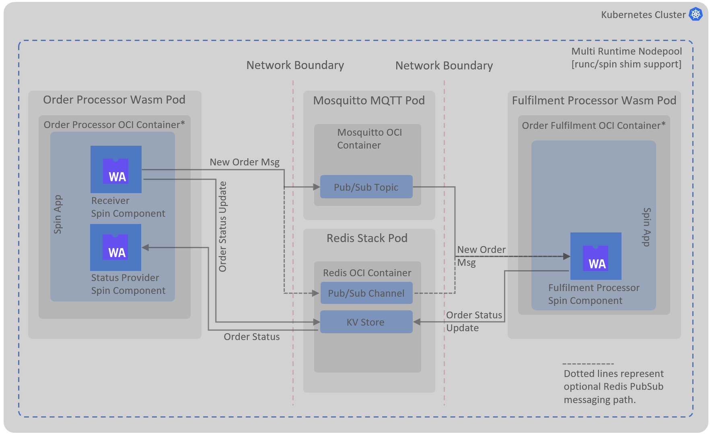

# Mixed Workloads with Web Assemblies (Spin) & Containers in Kubernetes
## Background

Web assembly (Wasm) is positioned to be the next iteration of serverless compute ecosystem, the serverless aspect of Wasm is hugely attractive as it allows you to write functions in a decoupled and portable manner. Decoupled, because you write functions' code which is not dependent on the host and environment (cloud provider bindings) it's running in, Matt Butcher from Fermyon wrote an amazing article on this [here](https://www.fermyon.com/blog/next-generation-of-serverless-is-happening?utm_content=251765820&utm_medium=social&utm_source=twitter&hss_channel=tw-1444404500437995520) which sets the context right away.
Portability aspect of Wasm comes from the fact that you compile your code to a Wasm bytecode (a bit like .Net MSIL or Java Bytecode) and this bytecode can then run independent of the host architecture in Wasm runtimes (e.g. Wasmtime).
Nevertheless, this repo is less about convincing you to make use of Wasm, it's more about how you can run Wasm functions (also know as modules or components) along side conventional OCI containers; this is likely to be the most common use case when you start considering Wasm for your solution. One of the reasons for that could well be that Wasm is not currently ready for running server (this is different to server-side workloads) workloads e.g. DBs, for that a conventional container is still a better (or only) choice. Since Kubernetes (K8s) is one of the most commonly used platforms for orchestrating containers, it would make sense to use it as a starting point to run mixed workloads (standard OCI containers and Wasm containers). This repo makes use of [K3d](https://k3d.io) to run OCI containers and Wasm containers in mixed mode.

## How Do We Run Wasm on Kubernetes (K8s)

K8s makes use of [Containerd shims](https://github.com/deislabs/containerd-wasm-shims) to replace the underlying container engine, one such shim is provided for Spin (a framework to run wasm components), please refer to [Wasm on K8s doc](docs/wasm-on-k8s.md) for more details.

## Solution Overview

This solution builds and deploys a pseudo ordering application to exemplify the mixed workloads on Kubernetes.

Following components are the key parts of this solution (arrows show data flow):

1. Kubernetes Cluster: a local kubernetes cluster (K3d) running both Wasm containers and standard OCI containers as pods.
2. Spin Shim: a Containerd shim for running Spin apps, updated the Spin shim which includes both http and redis triggers.
3. Spin Apps:
   Spin apps are packaged as OCI container images but Spin shim extracts the Spin config and binaries from it before running the apps directly, containers are only used for packaging Spin apps, not execution.
    1. Order Processor App:
       An app to receive new order and order status requests on http endpoints, contains two wasm components:
       * Receiver: implements Http Accept/202 pattern to acknowledge new order request immediately and publishes order message on Redis pub/sub.
       * Status Provider: returns order status for the order Id provided in query string (e.g. <http://localhost/order/839284>), by referencing order's current status in Redis KV store.
    2. Fulfilment Processor App:
       An app to receive published new order message from Redis pub/sub and update status to 'fulfilled' in Redis KV store.

## Codespaces and Local Development/Deployment

Please refer to [dev setup document](docs/dev.md) setup of the solution (no cloud services required).

## Potentially Reduced Network Hops Approach

Order Processor App's components interact with each other using Spin SDKs (for KV, Redis or Http) which requires network hops. This approach allows decoupling these components via messaging (Redis) or contract first approach (Http REST), and enables cross network placement of these components. On the flip side though, by introducing network to communicate between the components even when these components reside in the same Spin app/host, additional overheads become inevitable.

Drawing some parallels here from code level and service level design patterns, intra Spin orchestration of components can be considered as nano services which do not need to cross the boundary of network but still need to be composed together to form a business logic. By not involving network, we avoid the complex compensation logic (idempotency, circuit-breaker) in absence of transactions and serialization-deserialization of messages. Should we not need to expose these events to external (to Spin app) entities or there's a need for async communication, we really do not need to cross the network boundary here.

We know [Wasm Interface Types (WIT)](https://github.com/WebAssembly/component-model/blob/main/design/mvp/WIT.md) enables contract based development of wasm components and Spin framework supports this approach as well, natively. A [draft PR in Spin](https://github.com/fermyon/spin/pull/1536) repo is raised to highlight this and potential implementation will follow in a separate repo.
