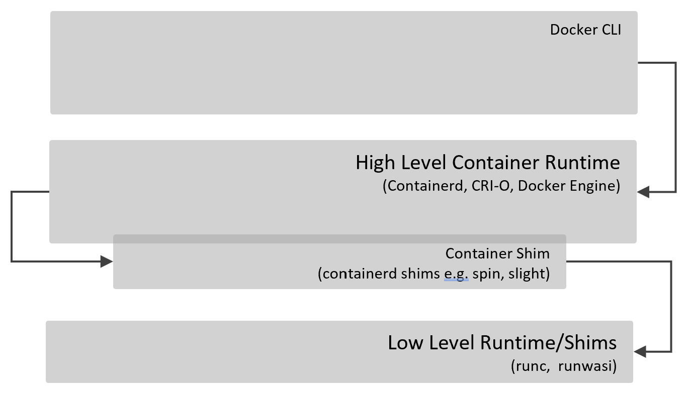
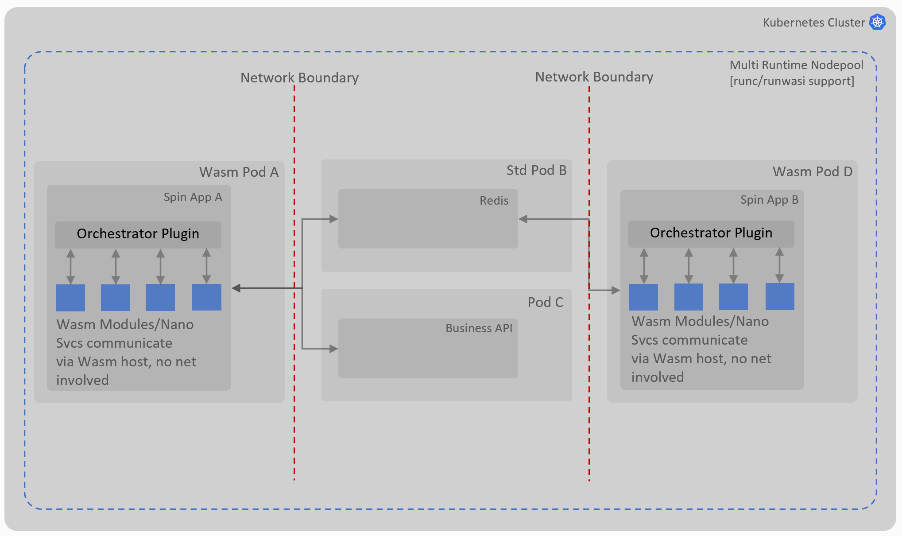

# Mixed Workloads with Web Assemblies (Spin) & Containers, with Reduced Network Hops

## Background

Web assembly(Wasm) is positioned to be the next interation of serverless compute ecosystem, the serverless aspect of wasm is hugely attractive as it allows you to write functions in a decoupled and portable manner. Decoupled, because you write functions' code which is not dependent on the host and environment (cloud provider bindings) it's running in, Matt Butcher from Fermyon wrote an amazing article on this [here](https://www.fermyon.com/blog/next-generation-of-serverless-is-happening?utm_content=251765820&utm_medium=social&utm_source=twitter&hss_channel=tw-1444404500437995520) which sets the context right away. Portability aspect of wasm comes from the fact that you compile your code to a wasm bytecode (like .Net MSIL or Java Bytecode) and this bytecode can then run independent of the host architecture in wasm runtimes (e.g. wasmtime).
Conviced? anyhow, this repo is less about convincing you to make use of wasm, it's more about how you can run wasm functions (also know as mmodules or components) along side conventional containers; this is likely to be the most common use case when you start to consider wasm for your solution, one of the reasons for that could well be that wasm is not currently ready for running server workloads e.g. DBs, for that a conventional container is still a better (or only) choice. Since Kubernetes (K8s) is one of the most commonly used platforms for orchestrating containers, it would make sense to use it as a starting point to run mixed workloads. This repo makes use of AKS which is Azure's managed K8s service.

## How Do We Run Wasm on AKS

AKS is Azure's managed K8s service, which allows creating a node pool with wasm based [containerd shims](https://github.com/deislabs/containerd-wasm-shims). Containerd shims create a layer between K8s and low level container runtimes, this mechanism is used to K8s to run wasm based containers instead of standard containers. Currently, at the time of writing this document, AKS supported two wasm based containerd shims i.e. [Spin and Slight](https://learn.microsoft.com/en-us/azure/aks/use-wasi-node-pools#limitations). These shims inturn make use of [runwasi](https://github.com/containerd/runwasi) runtime (like runc for standard containers) which is responsible for running wasm based containers instead of standard containers. This relationship is depitcted in the diagram below:

Other aspect of running wasm based containers on K8s is related to the packaging of applications, it would be prudent if we make use of the existing toolchain which is familair to native K8s users. Spin leverages this by bundling wasm based apps and their dependencies (any static files or configs) in an OCI container image. This is great for versioning, storing and releasing of wasm based application packages as you can make use the your usual container registries and tagging mechanisms. As the base image used by container images of wasm applications in Spin is [scratch](https://hub.docker.com/_/scratch), the size is substantially smaller than standard OS based container images.
Wasm shim for Spin then unpacks/removes the content of the image before running the application.

## Solution Approach

The approach is straightforward, and described by the following steps:

1. Deploy AKS cluster
2. Create a node pool with wasm shims pre-deployed on it
3. Deploy Spin app to this node pool
4. Deploy standard container apps to this node pool i.e. Redis in this instance

This will run the standard Spin application which may contain multiple wasm components/modules as part of it. These components communicate with each other using Spin SDKs (for KV, Redis or Http). This approach allows decoupling these components via messaging (Redis) or contracts (Http REST) and this is great. On the flip side though, by introducing external means to communicate between the components, additional overheads become inevitable. 

Below diagram compares and contrast the differences between the use of external services for inter module/component communication and an approach where we avoid this. On left, Pod A has four wasm components/modules, communication between these components occur via external service (Redis in this case). Should we not need to expose these events to external (to Spin app) entities we really do not need to cross the network boundary here.
Now compare this with Pod C, where inter module/component communication occur via a Spin plugin, the event/messages stay within the same Spin app and no network boundary is crossed. When event/messages do need to be exposed to external world they can certainly do that. This approach is defined in [Reduced Network Hop](#reduced-network-hops) section below.

Drawing some parallels here from code level and service level design patterns, intra Spin orchestration of modules can be considered as nano services which do not need to cross the boundary of network but still need to be composed together to form a business logic. By not involving network, we avoid the complex compensation logic (idempotency, circuit-breaker) in absence of transactions and serialisation-deserialization of messages. WIT contracts defined in the custom Plugin allows a contract driven development of wasm modules/components in a polyglot manner.

The next section below addresses this aspect of the solution in Spin.

### Reduced Network Hops

This approach enables intra Spin (within the same Spin instance) module/component orchestration using WIT contracts at the host level. It makes use of the plugin model extensibility Spin provides to build a domain specific orchestrator (a custom plugin). Domain specific plugin references a set of WIT contracts for multiple Wasm modules/components and invoke functions on wasm modules/components as per domain specific logic. These composed services may eventually then interact with other services (could be Spin based or otherwise) on the network using standard Spin SDKs e.g. Http.

## Deployment

[Steps to deploy solution with reduced network hops in Azure]

1. Ensure Docker Desktop is installed and setup with ["Use containerd for pulling and storing images"](https://docs.docker.com/desktop/containerd/) feature.
