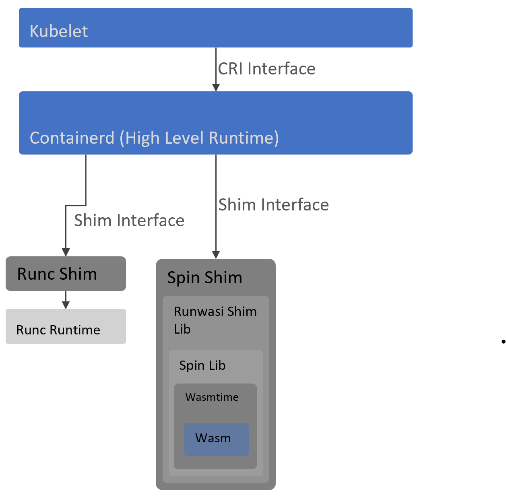

# Wasm on Kubernetes (K8s)

## Runtime

Containerd shims allows Containerd (a high level CRI compliant container runtime) to invoke any lower level container runtime based on a well defined interface, without being aware of its concrete implementation.
By default, in most cases, Containerd runtime is configured to invoke runc shim which inturn invokes [runc](https://github.com/opencontainers/runc) (a lower level container runtime to run standard OCI containers).

To run wasm based workloads, a new Containerd shim is created which is then configured in Containerd config on a K8s node. Instead of running and managing standard OCI container, this shim runs and manages Wasm components.

Wasm components run a sandbox, to be able to interact with the outside world and form a useful business service, a plumbing is required.
This plumbing allows Wasm component to seamlessly receive or send data from external messaging ecosystems like Redis. There are a few frameworks which provide this plumbing for Wasm components but Fermyon's Spin is one of leading ones and we have shim already available for this framework.

At the time of writing this document, there are two Wasm based Containerd shims i.e. [Spin and Slight](https://github.com/deislabs/containerd-wasm-shims) which are available on GitHub.
These shims make use of [runwasi](https://github.com/containerd/runwasi) runtime/lib (equivalent of runc container runtime in OCI container world) which is responsible container image handling (e.g. unpacking container image to extract wasm binaries and configs) and initiating wasm based frameworks (Spin/Slight) to host wasm components.

[TODO: Expand to include k8s runtimeclass resource kind]

Following diagram shows the above setup for Spin shim:

## Application Packaging

Other aspect of running Wasm based containers on K8s is related to the packaging of applications, it would be prudent if we make use of the existing toolchain which is familiar to native K8s users. Spin leverages this by bundling Wasm based apps and their dependencies (any static files or configs) in an OCI container image. This is great for versioning, storing and releasing of Wasm based application packages as you can make use of your usual container registries and tagging mechanisms. As the base image used by container images of Wasm applications in Spin is [scratch](https://hub.docker.com/_/scratch), the size is substantially smaller than standard OS based container images.
Wasm shim for Spin then unpacks/removes the content of the image before running the application.
